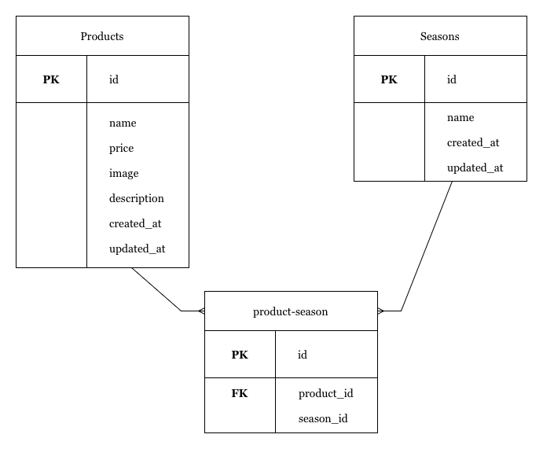

# mogitate（果物通販サイト）

## 環境構築

### 1. Docker ビルド

~~~bash
git clone git@github.com:52115/test2.git
cd test2
docker-compose up -d --build
~~~

**補足 — M1 / M2 Mac で発生する可能性のあるエラー**

以下のエラーが出てビルドできない場合は、`docker-compose.yml` の `mysql` に `platform` を追記してください。

no matching manifest for linux/arm64/v8 in the manifest list entries

例：

~~~yaml
mysql:
  platform: linux/x86_64  # この行を追加
  image: mysql:8.0.26
  environment:
    ...
~~~

---

### 2. Laravel 環境構築

コンテナに入ってから Composer をインストールします。

~~~bash
docker-compose exec php bash
composer install
~~~

---

### ３. 環境変数の設定

`.env.example` を `.env` にコピーするか、新しく `.env` を作成して以下を追加してください。

~~~env
DB_CONNECTION=mysql
DB_HOST=mysql
DB_PORT=3306
DB_DATABASE=laravel_db
DB_USERNAME=laravel_user
DB_PASSWORD=laravel_pass
~~~

---

### ４. アプリケーションキー作成

~~~bash
php artisan key:generate
~~~

---

### ５. マイグレーション・シーディング

~~~bash
php artisan migrate
php artisan db:seed
~~~

---

## 使用技術（実行環境）

| 技術    | バージョン  |
|---------|-------------|
| PHP     | 8.3.0       |
| Laravel | 8.83.27     |
| MySQL   | 8.0.26      |

---

## ER図

---

## 開発環境

- アプリケーション: http://localhost:8000/
- phpMyAdmin: http://localhost:8080/
